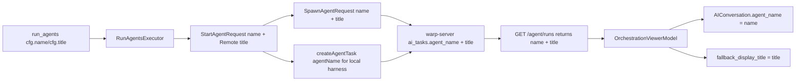

# QUALITY-731 — Agent name round trip client spec
## Context
QUALITY-731 is a shared-session viewer bug: the orchestrator's own client labels children with `agent_run_configs[i].name`, but a viewer reconstructs child conversations from server task records and currently only receives `title`. As a result, viewer-side pills, hover cards, breadcrumbs, status cards, transcript participant labels, and the conversation details panel can show a long title or a truncated prompt instead of the short agent name.
Relevant current client paths:
- `app/src/ai/blocklist/action_model/execute/run_agents.rs (101-151)` — `RunAgentsExecutor` fans out each `RunAgentsAgentRunConfig`; it passes `cfg.name` into `StartAgentExecutor::dispatch`.
- `app/src/ai/blocklist/action_model/execute/run_agents.rs (407-435)` — remote `run_agents` children carry `cfg.title` into `StartAgentExecutionMode::Remote`, separate from `cfg.name`.
- `app/src/ai/blocklist/action_model/execute/start_agent.rs (56-64, 445-519)` — `StartAgentRequest` carries `name` and `prompt`; remote/local harness children require `parent_run_id` so the server can record parentage.
- `app/src/pane_group/pane/terminal_pane.rs (1817-1977)` — `launch_remote_child` creates the local child conversation with `request.name`, but its `SpawnAgentRequest` only sends `title` to the server.
- `app/src/pane_group/pane/local_harness_launch.rs (81-196)` — local harness children create a server task through `AIClient::create_agent_task(prompt, ...)`, with no name parameter today.
- `app/src/server/server_api/ai.rs (205-245)` — `SpawnAgentRequest` serializes `title` and `parent_run_id`, but has no `name`.
- `app/src/server/server_api/ai.rs (916-975, 1638-1691)` — `AIClient::create_agent_task` and the `ServerApi` implementation create local task records through GraphQL, with no name field.
- `app/src/ai/ambient_agents/task.rs (237-276)` — `AmbientAgentTask` deserializes task `title` but no `name`.
- `app/src/terminal/shared_session/viewer/orchestration_viewer_model.rs (294-335)` — viewer child discovery currently sets child `agent_name` from `task.title`.
- `app/src/ai/blocklist/history_model.rs (398-433)` — `start_new_child_conversation` writes its `name` argument directly into `AIConversation::agent_name`.
- `app/src/ai/agent/conversation.rs (776-785, 1293-1309)` — `agent_name()` backs orchestration labels; `title()` falls back to `fallback_display_title`.
- `app/src/ai/conversation_details_panel.rs (285-352)` — `ConversationDetailsData::from_task` currently uses `task.title` as the side-pane title.
The matching server spec in `/Users/matthew/src/roundtrip-agent-name/warp-server/specs/QUALITY-731/TECH.md` defines the wire contract: task responses include optional JSON `name` while retaining descriptive `title`.
## Proposed changes
### Request types: send the short name to the server
Remote child creation:
1. Add `name: Option<String>` to `SpawnAgentRequest` in `app/src/server/server_api/ai.rs`, serialized as `name` and skipped when `None`.
2. In `launch_remote_child` in `app/src/pane_group/pane/terminal_pane.rs`, preserve `request.name` before moving it into `start_new_child_conversation` and send it as `SpawnAgentRequest.name`.
3. Continue sending `title: (!title.is_empty()).then_some(title)` unchanged. `name` and `title` are separate:
   - `name` is the short pill/display label.
   - `title` is the descriptive run title/fallback.
Local harness child task creation:
1. Extend `AIClient::create_agent_task` in `app/src/server/server_api/ai.rs` to accept `agent_name: Option<String>`.
2. Add the new field to `CreateAgentTaskInput` variables once GraphQL types are regenerated from the server schema.
3. Thread the child name through `prepare_local_harness_child_launch` in `app/src/pane_group/pane/local_harness_launch.rs` and pass `Some(request_name.clone())` from `launch_local_harness_child`.
4. Update all existing callers/tests to pass `None` when they are not creating a named orchestration child.
### Response types: deserialize optional `name`
1. Add `pub name: Option<String>` to `AmbientAgentTask` in `app/src/ai/ambient_agents/task.rs` with `#[serde(default)]`.
2. Keep `title: String` required because existing server responses already include it.
3. Add a helper on `AmbientAgentTask`:
   - `display_name(&self) -> &str` or `display_name(&self) -> String`
   - It should return trimmed `name` when present/non-empty, otherwise trimmed `title` when non-empty, otherwise `"Agent"`.
4. Use this helper anywhere the UI wants the short agent label. Use `title` only where the UI intentionally wants the descriptive title.
### Shared-session viewer child registration
Change `OrchestrationViewerModel::apply_children_fetch` in `app/src/terminal/shared_session/viewer/orchestration_viewer_model.rs`:
1. Replace the current `task.title`-based `name` derivation with `task.display_name()`.
2. After `start_new_child_conversation`, set the long descriptive title as fallback display metadata when it differs from the display name:
   - `conversation.set_fallback_display_title(task.title.clone())`
   - This keeps the existing hover-card/title fallback useful without polluting `agent_name`.
3. Add/update tests in `orchestration_viewer_model_tests.rs`:
   - New task with `name = "api"` and `title = "Implement the API refactor"` creates a child whose `agent_name()` is `"api"`.
   - The same child keeps `conversation.title()` or fallback metadata able to surface the long title.
   - A task with `name = None` falls back to `title`.
   - A task with empty/whitespace `name` falls back to `title` or `"Agent"`.
### Details panel and other task-title surfaces
The conversation details side pane (`ConversationDetailsData::from_task` in `app/src/ai/conversation_details_panel.rs`) is intentionally left on `task.title` for QUALITY-731. Switching this surface to the short orchestrator name is deferred pending product feedback: ultimately the panel may want to show both `name` (as a short header) and `title` (as a descriptive subline), and we should let usage feedback drive that decision rather than guess at the shape now.
What this means for implementation:
1. Do not change `ConversationDetailsData::from_task` to use `task.display_name()` as the primary panel title in this change. Leave `title: task.title.clone()` and `source_prompt: Some(task.prompt.clone())` untouched.
2. Do not add new tests asserting display-name behavior in the details panel as part of this change.
3. Still add `name: None` to any existing details-panel test fixtures that construct an `AmbientAgentTask` so they compile against the new field.
Other `AmbientAgentTask.title` call sites should be classified the same way:
- Short label surfaces (viewer pill bar, hover card, breadcrumb, child status card, transcript participant) use `display_name()` via `AIConversation::agent_name`.
- Long description/search/history surfaces (`agent_sdk/ambient.rs` CLI table, `data_source.rs` search, `agent_conversations_model/entry.rs` management list, tombstone fallback) keep `title`.
The core viewer bug is fixed when all surfaces that read `AIConversation::agent_name()` are seeded from server `name`. A future change can revisit the details panel header once product decides whether to show `name`, `title`, or both.
## End-to-end flow

## Testing and validation
Unit/client tests:
- `app/src/ai/ambient_agents/task.rs` tests for `AmbientAgentTask::display_name()` fallback order.
- `app/src/terminal/shared_session/viewer/orchestration_viewer_model_tests.rs` for name-vs-title registration and fallback behavior.
- `app/src/pane_group/pane/local_harness_launch_tests.rs` for threading the name into `create_agent_task`.
- `app/src/server/server_api/ai_tests.rs` for serialized `SpawnAgentRequest` including `name` when present and omitting it when absent.
- `app/src/ai/conversation_details_panel_tests.rs`: no behavior assertions about `display_name` for this change; only ensure existing fixtures construct `AmbientAgentTask` with `name: None`.
Manual validation:
1. Start or load an orchestrated shared session where a child has `name = "frontend-tests"` and a long title.
2. Open the session as a viewer.
3. Verify the pill label, hover card participant label, breadcrumb, child status card, and transcript participant all use `frontend-tests`. The conversation details side pane intentionally still shows `task.title` for this change.
4. Verify the long title remains available as fallback metadata where existing hover/title fallback is used.
5. Repeat with a child whose `title` is omitted so the server derives title from prompt; verify the UI still shows the short `name`.
6. Repeat against an older server response without `name`; verify fallback to `title` avoids blank labels.
Recommended commands after implementation:
- Targeted tests for touched units, for example:
  - `cargo test -p warp -- terminal::shared_session::viewer::orchestration_viewer_model_tests`
  - `cargo test -p warp -- ai::ambient_agents::task`
  - `cargo test -p warp -- ai::conversation_details_panel_tests`
  - `cargo test -p warp -- pane_group::pane::local_harness_launch_tests`
  - `cargo test -p warp -- server::server_api::ai_tests`
- Before pushing or opening/updating a PR, run `./script/presubmit`. This script checks `cargo fmt -- --check`, `cargo clippy` for the workspace and `warp_completer`, clang-format, `wgslfmt`, PowerShell linting when available, `cargo nextest run --no-fail-fast --workspace --exclude command-signatures-v2`, `cargo nextest run -p warp_completer --features v2`, and `cargo test --doc`.
- If the full presubmit is too slow during iteration, run `cargo fmt`, the targeted tests above, and a relevant `cargo clippy` subset before the final `./script/presubmit`.
- Because this changes visible viewer/details labels, run manual UI verification with a local client connected to a server containing the server-side change.
## Parallelization
This work can proceed in parallel with the server changes, but the wire shape must remain `name?: string` plus existing `title: string`.
- Server agent: local, `/Users/matthew/src/roundtrip-agent-name/warp-server`, branch `matthew/roundtrip-agent-name`, base `origin/develop`, draft PR target `develop`. Owns persistence/API/schema changes and server tests.
- Client agent: local, `/Users/matthew/src/roundtrip-agent-name/warp`, branch `matthew/roundtrip-agent-name`, base `origin/master`, draft PR target `master`. Owns Rust request/response changes, viewer/detail UI behavior, and client tests.
Use one draft PR per repo. Create/link the server PR first because it defines the API/schema contract, then link that server PR from the client PR as a dependency. The client can implement first because `name` is optional and serde `#[serde(default)]` is backward-compatible, but end-to-end manual validation must wait until the server branch returns `name` from `GET /agent/runs`.
Client PR requirements:
- Use `warp/.github/pull_request_template.md`.
- Keep the PR in draft mode unless explicitly told otherwise.
- Include screenshots or a short video for the viewer/details UI behavior when manual validation is complete.
- Mark the `Warp Agent Mode - This PR was created via Warp's AI Agent Mode` checkbox if an agent authored code.
Server PR requirements for the linked dependency:
- Use `warp-server/.github/pull_request_template.md`.
- Target `develop`, keep the PR in draft mode unless explicitly told otherwise, and include the server-side validation from the paired server spec.
## Risks and mitigations
- `request.name` ownership in `launch_remote_child`: it is currently moved into `start_new_child_conversation`. Clone it before the move so both the local conversation and server request get the same short name.
- Older server compatibility: make `AmbientAgentTask.name` optional with serde default and never require it for deserialization.
- Misusing `title` again: introduce a small helper (`display_name`) and prefer it for label surfaces to avoid repeated ad hoc fallback logic.
- Local harness children: remote children use `SpawnAgentRequest`, but local harness children use GraphQL `createAgentTask`; both paths must be updated or viewer labels will remain inconsistent for local-child pills.
